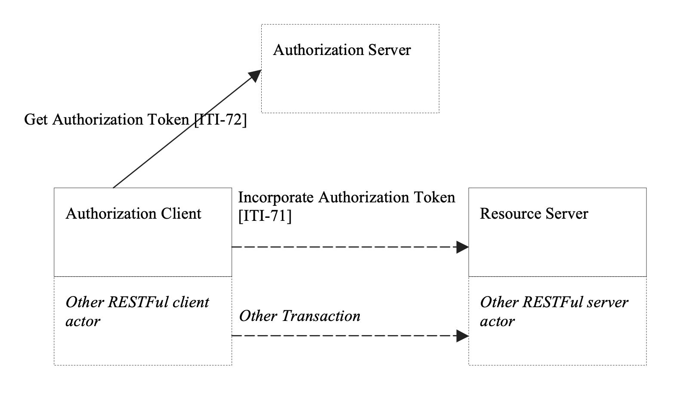
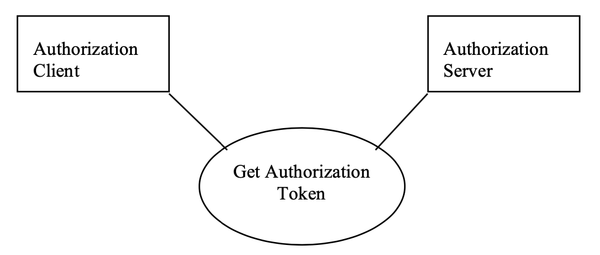
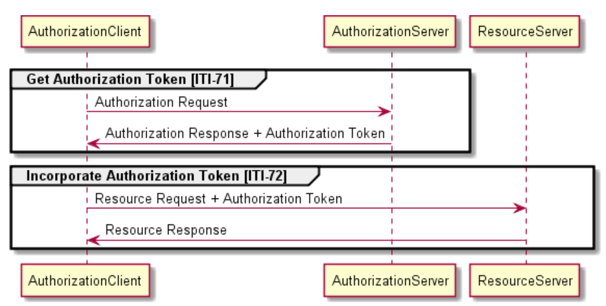
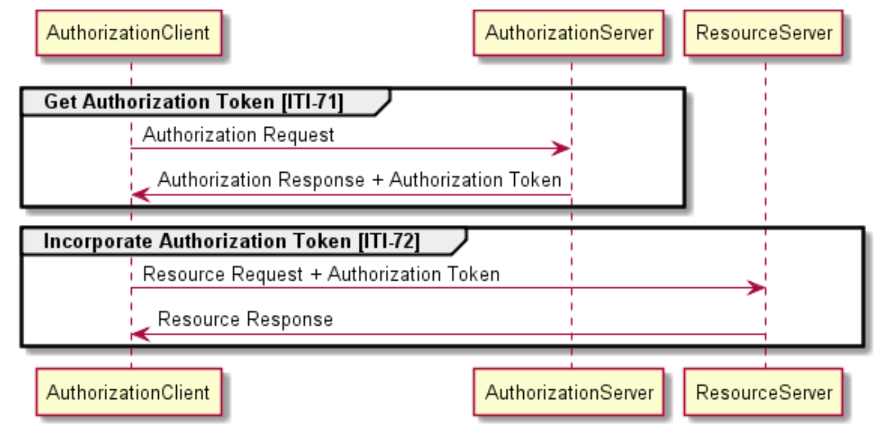

**Integrating the Healthcare Enterprise**


**IHE ITI**

**Technical Framework Supplement**

**Internet User Authorization\
(IUA)**

**Trial Implementation**

Date: September 21, 2019

Author: ITI Technical Committee

Email: iti@ihe.net

**Please verify you have the most recent version of this document.** See
[here](http://ihe.net/Technical_Frameworks/) for Trial Implementation
and Final Text versions and [here](http://ihe.net/Public_Comment/) for
Public Comment versions.

**Foreword**

This is a supplement to the IHE IT Infrastructure Technical Framework
V11.0. Each supplement undergoes a process of public comment and trial
implementation before being incorporated into the volumes of the
Technical Frameworks.

This supplement is published on August 31, 2015 for trial implementation
and may be available for testing at subsequent IHE Connectathons. The
supplement may be amended based on the results of testing. Following
successful testing it will be incorporated into the IT Infrastructure
Technical Framework. Comments are invited and may be submitted at
[http://www.ihe.net/ITI\_Public\_Comments](http://www.ihe.net/ITI_Public_Comments/).

This supplement describes changes to the existing technical framework
documents.

"Boxed" instructions like the sample below indicate to the Volume Editor
how to integrate the relevant section(s) into the relevant Technical
Framework volume.

Amend Section X.X by the following:

Where the amendment adds text, make the added text **[bold
underline]{.underline}**. Where the amendment removes text, make the
removed text **~~bold strikethrough~~**. When entire new sections are
added, introduce with editor's instructions to "add new text" or
similar, which for readability are not bolded or underlined.

General information about IHE can be found at:
[http://www.ihe.net](http://www.ihe.net/).

Information about the IHE IT Infrastructure domain can be found at:
[http://www.ihe.net/IHE\_Domains](http://www.ihe.net/IHE_Domains/).

Information about the structure of IHE Technical Frameworks and
Supplements can be found at:
[http://www.ihe.net/IHE\_Process](http://www.ihe.net/IHE_Process/) and
[http://www.ihe.net/Profiles](http://www.ihe.net/Profiles/).

The current version of the IHE Technical Framework can be found at:
[http://www.ihe.net/Technical\_Frameworks](http://www.ihe.net/Technical_Frameworks/).

**CONTENTS**

[Introduction to this Supplement](#introduction-to-this-supplement)

[Problem Statement](#problem-statement)

[Background on the problem environment](#background-on-the-problem-environment)

[Open Issues and Question](#open-issues-and-question)

[Closed Issues](#closed-issues)

[General Introduction](#general-introduction)

[Appendix A - Actor Summary Definitions](#_Toc428776515)

[Appendix B - Transaction Summary Definitions](#_Toc428776516)

[Volume 1 -- Profiles](#_Toc428776517)

[34 IUA Profile 10](#_Toc428776518)

[34.1 IUA Actors, Transactions, and Content Modules](#iua-actors-transactions-and-content-modules)

[34.1.1 Actor Descriptions and Actor Profile Requirements](#actor-descriptions-and-actor-profile-requirements)

[34.1.1.1 Authorization Client](#authorization-client)

[34.1.1.2 Authorization Server](#authorization-server)

[34.1.1.3 Resource Server](#resource-server)

[34.2 IUA Actor Options](#iua-actor-options)

[34.2.1 SAML Token Option](#saml-token-option)

[34.2.2 OAuth Bearer Token Option](#oauth-bearer-token-option)

[34.3 IUA Required Actor Groupings](#iua-required-actor-groupings)

[34.4 IUA Overview](#iua-overview)

[34.4.1 Concepts](#concepts)

[34.4.2 Use Cases](#use-cases)

[34.4.2.1 Simple Authorization](#simple-authorization)

[34.4.2.2 Delegation](#delegation)

[34.4.2.2.1 Obtaining a token](#obtaining-a-token)

[34.5 IUA Security Considerations](#iua-security-considerations)

[34.6 IUA Cross Profile Considerations](#iua-cross-profile-considerations)

[Volume 2 -- Transactions 18](#_Toc336000611)

[3.71 Get Authorization Token](#get-authorization-token)

[3.71.1 Scope](#scope)

[3.71.2 Actor Roles](#actor-roles)

[3.71.3 Referenced Standards](#referenced-standards)

[3.71.4 Interaction Diagram](#interaction-diagram)

[3.71.4.1 Authorization Request](#authorization-request)

[3.71.4.1.1 Trigger Events](#trigger-events)

[3.71.4.1.2 Message Semantics](#message-semantics)

[3.71.4.1.2.1 JSON Web Token (JWT)](\l)

[3.71.4.1.2.2 SAML Token Option](\l)

[3.71.4.1.2.3 OAuth Bearer Token Option](#oauth-bearer-token-option-1)

[3.71.4.1.3 Expected Actions 22](#expected-actions)

[3.71.5 Security Considerations 22](#security-considerations)

[3.71.5.1 Security Audit Considerations](\l)

[3.71.5.1.1 Authorization Server Specific Security Considerations](\l)

[3.71.5.1.2 Client Authorization Agent Specific Security Considerations](\l)

[3.72 Incorporate Authorization Token](#incorporate-authorization-token)

[3.72.1 Scope](#scope-1)

[3.72.2 Actor Roles](#actor-roles-1)

[3.72.3 Referenced Standards](\l)

[3.72.3.1 Related IHE Profiles](#related-ihe-profiles)

[3.72.4 Interaction Diagram](#interaction-diagram-1)

[3.72.4.1 Authorization Request message](#authorization-request-message)

[3.72.4.1.1 Trigger Events](#trigger-events-1)

[3.72.4.1.2 Message Semantics](#message-semantics-1)

[3.72.4.1.2.1 SAML Token Option](\l)

[3.72.4.1.2.2 OAuth Bearer Token Option](#oauth-bearer-token-option-2)

[3.72.4.1.3 Expected Actions](#expected-actions-1)

[3.72.5 Security Considerations](\l)

[3.72.5.1 Security Audit Considerations](\l)

[3.72.5.1.1 Resource Server Specific Security Considerations](\l)


# Introduction to this Supplement

### Problem Statement

This profile is motivated by customer requirements for authorizing
network transactions, when using HTTP RESTful transports. IHE has
authorization profiles for the Web Services and SOAP based transactions.
This profile provides an authorization profile for the HTTP RESTful
transactions, e.g., browser based.

Being authorized means that the user, patient or provider, has
legitimate access to this HTTP RESTful service. The authorization
includes identifying the user, device, and or application that is making
the request to the HTTP RESTful server, so that server can make further
access control decisions.

The HTTP RESTful transport is being used by many healthcare applications
and smart devices. These share a common set of issues. A typical use
case example is:

-   The patient has a tablet and installs an application onto that
    tablet.

-   An application will need to retrieve and update health related data
    that is stored on a resource server. It uses HTTP RESTful
    transactions for both retrieve and update because HTTP support is
    integrated into the platform services.

-   The patient already has an established relationship with an
    authorization service, e.g., Google, Facebook, or banking service.

-   The patient wants to configure the application to have access to
    their data without needing the IT staff at the application vendor
    and resource vendor to set things up.

The HTTP RESTful services may include user driven browser activity,
downloaded applications, and automatic devices. The existing IHE ITI XUA
Profile fills these needs for the SOAP transport based transactions. The
existing IHE ITI EUA Profile fills these needs for various different
transports within a single enterprise environment, including HTTP
RESTful transports. The Basic Patient Privacy Consent (BPPC) Profile is
associated with this profile and these other existing profile. BPPC
covers the legal and administrative needs for consent documentation and
associating the patient consent with policy documentation. This profile
includes the ability to associate the electronic authorizations with the
patient agreements and organizational policies.

Greater integration of this authorization with third party authorization
and consent documentation profiles, such as those found in the IHE BPPC
Profile, are a future effort. This profile starts with just the basic
authorization activities.

It is important to understand that IUA is not a substitute for the
administrative activities (such as withdrawing consent), policy setting,
and other activities that BPPC documents.

The administrative actions needed to establish a third party as an
authorization server for IUA is not covered by these actors or
transactions. These activities are very much dependent upon the
operational needs and privacy policies that apply to a particular
deployment.

The IUA Profile does convey the identifiers and signatures needed to
establish traceability between the Authorized HTTP RESTful transaction
and the policies and consents behind that authorization.

### Background on the problem environment

One common pattern is to interact directly with the application to
communicate with the authorization service. The application interacts
with both patient and authorization service to support the granting of
an access token. The application then saves the access token, and uses
it to retrieve and update the health related data. Another common
pattern is for the user to interact independently with the authorization
service and obtain a token. This token is saved on the device for later
use.

The key issues here are:

-   Reliable and accurate authorization decisions, as part of an overall
    privacy protecting and security environment.

-   Application developers want one common method for obtaining and
    using these tokens, not thousands. They want a method that is built
    into the common platforms, not one that must be added later, because
    it is difficult for end user oriented applications to modify the
    platforms.

-   Resource servers want one common method for receiving these tokens
    as part of HTTP RESTful transactions, and one common method for
    processing these tokens. (They will settle for a small number of
    methods if they must.)

-   Users, patients and providers, want to be in control, do not want to
    depend on support staff to set up their devices and applications,
    and want to minimize the interference from authorization
    requirements.

Similar issues arise with:

-   In house application distribution that needs to authorization for
    devices used within the facility.

-   The in house IT staff wants a common method to authorize use of in
    house web applications and access to in house resources.

-   IT staff are more willing to run their own internal authentication
    and authorization servers, but want to use off the shelf software
    and want the option to outsource these services. They are more
    likely to separate authentication from authorization than end user
    systems. Authentication issues are closely related to HR activities
    like hiring and firing. Authorization issues are related to patient
    and work assignments. These are controlled by different parts of the
    organization and have different process dependencies.

-   Efficient user workflow requires minimizing the number of times a
    person is challenged for authentication by interactive applications.

-   Providers and Specialists have authorization needs for dealing with
    other organizations.

-   Providers and specialists need to deal with hundreds of resource
    services. A provider panel of 10,000 patients will need hundreds of
    relationships with different specialists, labs, priors, and other
    providers.

-   The providers and specialists struggle to maintain hundreds of
    different authentication and authorization relationships today.
    Their IT staff struggle to support at all these different
    relationships. Neither wants delays or problems that will impact
    patient care.

-   Efficient user workflow requires minimizing the number of times a
    person is challenged for credentials for interactive applications.

-   Granting subset access to specialized provider. E.g., read access to
    cardiac info to physical therapy organization, forbidding access to
    other data like reproductive health and addiction data.

There are also environmental assumptions made by this profile.

First, it is assumed that there will be multiple access control engines
working together. The IUA activities are one part of a federated system.
IUA will work in conjunction with other access control engines. For
example, a glucose monitor may be authorized to have access to a
patient's medical record. The expectation is that this will mean access
to all of the glucose related information, which will include a variety
of measurements and prescriptions. But, it is expected that if the
device requests information about sexually transmitted disease diagnosis
it will be rejected.

Second, this profile is operating in an environment where access
consents are managed by BPPC or other mechanisms. IUA is not a
substitute for documenting, establishing, and modifying these legal
agreements. It is a method by which those agreements are enforced. For
example, there will be a documented consent agreement between a patient
and a provider that the provider will provide medical records to a
healthcare proxy that is identified and authorized by the patient. BPPC
is one way to document that agreement.

# Open Issues and Question


| Issue                             | Description                       |
|-----------------------------------|-----------------------------------|
| 1                                 | This profile does not specify the internal structure of "client\_id". This is a major concern for operations and security management. But, OAuth does not provide a full specification for client\_id. It just specifies its purpose.       |
|                                   | DICOM's equivalent information attributes are: Manufacturer, Model, Software Versions, and  Serial Number. |
|                                   | The OAuth client ID must identify the device, the application (including any necessary version  information), the particular instance, and any other  information needed to identify the client application uniquely.  |
|                                   | Registration of clients is a significant operational and security problem that is being postponed until there is more experience with problems in the field and reasonable solutions. There is known danger from spoofing of client\_id. |
|                                   | At this time, the method for  assignment of client\_id is not included in the profile. In the field there are a variety of methods being tried. Many depend upon physical distribution  methods or out of band communications to manage the authentication problems.          |
| 2                                 | This profile mandates support for JWT token format. It has an XUA SAML Option defined by IHE for ease of integration with the IHE WS-Security environment. You may also use other token formats as part of a deployment.             |
| 3                                 | Audit messages are only defined for clients that are also Secure Applications. There is no defined auditing for other clients.       |
| 4                                 | This profile does not require client grouping with Secure Node or Secure Application because it is using the OAuth issuance rules for client\_id, see the security consideration section. It assumes that the client\_id management will deal with these security considerations in a manner similar to the certificate management assumptions made for TLS and other certificate users.  |

# Closed Issues


| Issue                             | Description                      
|-----                              |-----
| 8                                 | This profile uses the Authorization header only for conveying the authorization information. The parameter form is not prohibited but is not compliant with the profile.       |
| 9                                 | This profile does not explain the ways that some Resource Servers utilize HTTP redirects to automate some kinds of  authorization activities. The actual HTTP transactions used for Obtain Authorization Token and Authorized RESTful Transaction are as defined within this profile. The other transactions  are under the control of the Resource Server and its design.   |
|                                   |                                   |
|                                   | Is an IHE explanation of how this works needed, or is the extensive industry documentation and tutorials used in other fields sufficient? No.        |
| 10                                | The selected standards are: |
|                                   | - The OAuth 2.0 Framework, |
||-JWT Token, with defined extensions,
||-SAML Token, using the XUA extensions                    |


# General Introduction

Update the following Appendices to the General Introduction as indicated
below. Note that these are not appendices to Volume but rather to the
General Introduction.

**Appendix A - Actor Summary Definitions**

Add the following actors to the IHE Technical Frameworks General
Introduction list of actors:

|Actor                |Definition                                                         |
|-----                |----------                                                         |
|Authorization Client |A client that presents authorization tokens as part of transactions|
|Authorization Server |A server that provides authorization tokens to requesting clients  |
|Resource Server      |A server that provides services that need authorization            |


**Appendix B - Transaction Summary Definitions**

Add the following transactions to the IHE Technical Frameworks General
Introduction list of Transactions:

|Transaction                                |Definition |
|-----------                                |---------- |
|Incorporate Authorization Token \[ITI-72\] |Add an authorization token to a transaction|
|Get Authorization Token \[ITI-71\]         |A transaction that is used to request and obtain an authorization token for use in Authorized transactions.|


# Volume 1 -- Profiles


# 34 IUA Profile

The IUA Profile adds authorization information to HTTP RESTful
transactions. The IUA actors and behavior will be added to other
profiles and transactions that need authorization.

## 34.1 IUA Actors, Transactions, and Content Modules

The actors in the IUA Profile manage the tokens used for authorization of access to HTTP RESTful services. The Authorization Client provides the authorization token that is incorporated into HTTP RESTful transactions to indicate that this transaction is authorized. The Authorization Client can also manage the interactions with an Authorization Server to obtain the authorization token.

The OAuth 2.0 Authorization Framework requires client identification, which may be based on a *client_id* parameter [RFC 6749, Section 3.2.1]. Depending on the OAuth 2.0 grant type, the use of the *client_id* MAY be required. For example the *Authorization Code* grant type requires the use of the *client_id* for client identification [RFC 6749, Section 4.1.3], while the *Client Credential* grant type does not [RFC 6749, Section 4.4.2].

The OAuth 2.0 Authorization Framework also requires client authentication for confidential clients [RFC 6749, Section 2.3], where any suitable HTTP based authentication scheme matching the security policy of the Authorization Server [RFC 6749, Section 2.3.2] may be used.

This profile requires the use of a *client_id* for client identification and a *client_secret* for client authentication of confidential clients, if no other methods for identification and authentication are used.  

Depending on the grant type, the OAuth 2.0 Framework also requires user (or resource owner) authentication. For example, the *Authorization Code* grant type covered by this profile requires user authentication [RFC 6749, Section 4.1], while the *Client Credential* grant type does not [RFC 6749, Section 4.4]. The methods used by the authorization server to authenticate the resource owner (e.g., username and password login, session cookies, delegation to Authentication Server) is not scoped in the OAuth 2.0 Authorization Framework [RFC 6749, 3.1].

Since user (resource owner) authentication methods chosen depend on the projects or national security policy, they are not scoped in this profile and SHALL be defined in the specific implementation projects or national extensions of this profile. If the user (resource owner) authentication is not implemented in the Authorization Server, the use of OpenID Connect with the Authorization Grant or Hybrid flow is recommended.

As defined in the Auth 2.0 Authorization Framework, the Resource Server enforces the authorization policies based on the information provided in the access token. The Ressource Server may provide the information from the access token to actors it is grouped with, or by delegating the authorization decisions to other actors, e.g, by implementing the Authorization Decisons Verifier actor of the Secure Retrieve (SeR) supplement.   



Figure 34.1-1: IUA Actor Diagram

Table 34.1-1 lists the transactions for each actor directly involved in
the IUA Profile. To claim compliance with this profile, an actor shall
support all required transactions (labeled "R") and may support the
optional transactions (labeled "O").

Table 34.1-1: IUA Profile - Actors and Transactions

|Actors               |Transactions                     |Optionality|Reference      |
|----                 |----                             |---        |-----          |
|Authorization Client |Incorporate Authorization Token  |R          |ITI TF-2c: 3.72|
|                     |Get Authorization Token          |O          |ITI TF-2c: 3.71|
|Authorization Server |Get Authorization Token          |R          |ITI TF-2c: 3.71|
|Resource Server      |Incorporate Authorization Token  |R          |ITI TF-2c: 3.72|

### 34.1.1 Actor Descriptions and Actor Profile Requirements

The IUA actors are expected to be combined with other actors that
perform HTTP RESTful transactions. Combining an Authorization Client
with another actor means that this other actor will provide an
authorization token as part of the HTTP transaction to a HTTP RESTful
server. It may perform the Get Authorization transaction to obtain the
authorization token. The corresponding HTTP RESTful server should be
combined with the Resource Service to indicate that the server can
perform access control.

#### 34.1.1.1 Authorization Client

The Authorization Client performs the network transactions and user
interactions needed to obtain an authorization token and to attach that
token to transactions to indicate that those transactions are
authorized. An Authorization Client in IUA supports the following
associated transactions:

-   The Incorporate Authorization Token transaction -- In this case the
    authorization token has already been obtained and is communicated as
    part of the HTTP RESTful transaction for some other profile or
    service. This token indicates that the HTTP RESTful transaction has
    been authorized by the Authorization Server for a particular kind of
    service and particular device by an authenticated person.

-   The Get Authorization Token -- In this use, the authorization client
    interacts with an Authorization service and Authentication Service
    as needed to obtain a token that indicates HTTP RESTful transactions
    for a particular kind of service and device are authorized by a
    particular person. This will often include various interactions with
    the user for authentication purposes. Those interactions are outside
    the scope of this profile, and may involve biometric or other
    identification activities. The resulting token is saved for later
    use by the authorization client. These tokens are not themselves
    protected from copying or modification, so they must be protected by
    the Authorization Client and transactions.

#### 34.1.1.2 Authorization Server

The Authorization Server provides authorization tokens to requesting
clients. In IUA, the Authorization Server uses an authenticated user
identity, the requested HTTP RESTful service URL, and other information
to determine whether HTTP RESTful transactions are allowed. If they are
allowed, the Authorization Server provides a token indicating that HTTP
RESTful service access is authorized.

#### 34.1.1.3 Resource Server

The Resource Server provides services that need authorization. In IUA
the Resource Server accepts a HTTP RESTful transaction request with an
authorization token attached. It evaluates the authorization token to
verify that the Authorization Server has already determined that this
transaction is authorized. The Resource Server must enforce this
authorization and may perform additional authorization decisions that
are specific to the requested service. The Resource Server may then
allow the transaction to proceed, subject to access control constraints
that may also be in place.

Notes: 1. For implementation and deployment reasons the Resource Server
and Authorization Server can be combined into an integrated product
together with user authentication, access control, and other services.
This does not change the actor requirements or transactions used.

2\. Many Resource Servers will perform additional access control
decisions and may restrict responses even for authorized transactions.

## 34.2 IUA Actor Options

All actors are required to support at least the JSON Web Token format
(JWT). They may support the SAML Token or OAuth Bearer Token options.

There are two token options:

The SAML Token Option enables integration of environments that use both
SAML identity federation and OAuth authorization infrastructure. This
enables the end user to control authorization of applications through
OAuth when the user identity authentication is already provided through
SAML identity federation.

The OAuth Bearer Token Option provides basic compatibility to minimal
OAuth implementations and does not carry the healthcare attribute
extensions.

The JWT Token type and the SAML Token type enable the Resource Server to
make additional Access Control Decisions.

Table 34.2-1: IUA - Actors and Options

| IUA Actor            | Option Name        | Reference |
|----------------------|--------------------|-----------|
| Authorization Server | SAML Token         | 34.2.1    |
|                      | OAuth Bearer Token | 34.2.2    |
| Resource Server      | OAuth Bearer Token | 34.2.1    |
|                      | SAML Token         |           |
| Authorization Client | SAML Token         | 34.2.1    |
|                      | OAuth Bearer Token | 34.2.2    |

### 34.2.1 SAML Token Option

An Authorization Client , Resource Server, or Authorization Server that
claims the SAML Token Option shall be able to use or generate the SAML
tokens defined in the SAML Token Option. See ITI TF-2c:3.71.4.1.2.2 and
3.72.4.1.2.1.

This option allows deployments that are using the Web Services
transactions and SAML Tokens to use the same SAML-based identity
mechanisms for HTTP RESTful transactions.

### 34.2.2 OAuth Bearer Token Option

An Authorization Client, Resource Server, or Authorization Server that
claims the OAuth Bearer Token Option shall be able to use or generate
the OAuth Bearer tokens defined in the OAuth 2.0 framework as the access
token for IUA. See ITI TF-2c:3.71.4.1.2.3 and 3.72.4.1.2.2.

## 34.3 IUA Required Actor Groupings

An actor from this profile (Column 1) shall implement all of the
required transactions and/or content modules in this profile ***in
addition to*** all of the transactions required for the grouped actor
(Column 2).

  |IUA Actor            |Actor to be grouped with   |Reference                    |Content Bindings Reference |
  |----                 |-----                      |-----                        |-----                      |
  |Authorization Server |Time Client                |ITI TF-1:7 Consistent Time   |                           |
  |Resource Server      |Time Client                |ITI TF-1:7 Consistent Time   |                           |
  |Authorization Client |                           |                             |                           |

This profile does not require client grouping with and ATNA Secure Node
or Secure Application. The security requirements for either of those
actors may be excessive for some of the clients that will be using HTTP
RESTful transactions.

## 34.4 IUA Overview

### 34.4.1 Concepts

The term "authorization" and "access control" are used colloquially for
a variety of related activities. All of the concepts listed below are
sometimes called "authorization" or "access control". See the IHE ITI
Access Control whitepaper for a detailed discussion of Access Control
concepts. This profile will use more specific terms for each of these
activities. These are:

-   Provisioning -- Setting up the initial rules and updating them when
    the situation changes. The administrator may say "Authorize Dr. X to
    have access". The steps taken to make this happen are called
    provisioning.

-   Delegation -- Adding, transferring and revoking authorization from
    one person to another. This is closely related to provisioning. It
    differs in that it can only transfer authority that has already been
    provisioned, and it may track changes to provisioned access for the
    original person.

-   Authentication -- Determining that the actual user (at the moment of
    authentication) is the claimed identity.

-   Authorization -- Determining that the authenticated user is
    authorized to have access to a resource (at the moment of
    authorization). The profile describes how to convey an access
    authorization decision. It is not defining how the decision is made.

-   Access Control -- A system of provisioning, delegation,
    authentication, and authorization. It is normal to have multiple
    nested levels of access control. This profile is concerned with
    whether access is allowed to make the HTTP transaction requests to
    the specified resources. There are likely also building access
    controls, resource server access controls, and other access controls
    involved.

Within this profile, authorization is limited to the definition of
authorization above.

### 34.4.2 Use Cases

The primary use cases are for obtaining authorization for access to a
resource using HTTP RESTful HTTP transactions. There are other use cases
for delegation, provisioning, etc., which are out of scope for this
profile.

The authorization service is separated from the HTTP RESTful access so
that it can be provided by a different organization or part of the
organization than the resource service. This is driven by the
requirements of patients, providers, and other users to simplify and
maintain autonomy and control over authorization services. A user may
interact with dozens of providers. It is difficult for the user to
coordinate different authorization mechanisms with each of these dozens
of providers.

This pattern is a common Internet usage and there are already vendors of
bs that are being used to solve this problem. These include Facebook,
Google, and a variety of other service providers in different commercial
and governmental sectors. Some countries may use their citizen identity
card to access their governmental services. These overlap with providers
of authentication services. These services allow a patient to establish
an authentication and authorization relationship with minimal
provisioning by the healthcare provider. The user can specify "use
vendor X" to their healthcare provider.

The pre-requisites for this use case are:

-   The User has established a relationship with the Authorization services.

-   The resource service has agreed to recognize this Authorization
    service. This can be easier than establishing and maintaining their
    own patient facing authentication and authorization services. The
    agreement to use an external service is a significant policy choice,
    because it is accepting some shared responsibility for choosing
    suitable authentication and authorization services. The user shares
    part of this decision responsibility, but local laws and regulations
    will affect a resource servicer's decision to accept and use a third
    party authorization and authentication service.

-   The authentication and authorization services have agreed to be used
    by the User and resource service provider.

#### 34.4.2.1 Simple Authorization

A user with a mobile device wishes to retrieve a medical document to
which they have authorized access.

The user communicates first with the authentication and authorization
services to obtain an authorization token that will be presented to the
resource service. This authorization token will be used as part of an
access control decision by the resource service.

The User could be any kind of participant, and the resource use could be
retrieval, query, or storage of a resource by means of HTTP
transactions.

#### 34.4.2.2 Delegation

There are multiple reasons to perform delegations. These cases primarily
involve patient delegation choices. Providers rarely have the authority
to delegate. IT staff may use delegation as part of the support for
autonomous devices.

The IUA Profile addresses the first of these use cases. It will likely
be a portion of a larger system solution for the other use cases. They
involve more technical, policy, and procedural complexity. They will
likely require additional actors, transactions, or content modules.

Users may delegate authority to:

-   Device or applications that are performing a service for the
    patient, for example automatic glucose monitors that can provide
    monitoring records and receive control information from a healthcare
    provider service that is providing diabetic care.

-   Applications that are distributed across multiple devices, or
    multiple instantiations, that are intended to act in a coordinated
    manner for a specific user. E.g., Kindle devices synchronize last
    read location, documents available, etc. across multiple Kindle
    devices for a single user account.

-   Advocates and proxies who are authorized by the patient to make
    decisions for the patient.

-   Organizations that are acting for the patient, such as a visiting
    nurse organization that is providing support to the patient.

Revocation of delegation needs to be clearly specified by policy.
Revocation may be removal of rights because of swapping devices.
Expiration, re-authorization, etc. also need to be covered. Revocation
is not just a response to breaches and failures. Revocation is a normal
response to changes in people, equipment, and relationships.

##### 34.4.2.2.1 Obtaining a token

The Incorporate Authorization Token transactions use an authorization
token to indicate that this transaction is authorized. This token can be
obtained by means of the Get Authorization Token [ITI-72], or by other
methods.

The OAuth 2 framework [RFC6749] defines multiple methods for obtaining a token, with a different set of message exchanges. The method chosen is foreseen project-specific, as it depends on the deployment scenario (e.g., web applications running on web browser, smartphone apps, medical devices) and on the authorization server policies. In fact, to obtain a token the client may also be requested to use some form of user authentication (e.g.,[RFC 6749, Section 4.1.1], [RFC 7521], [RFC 7522], [RFC 7523]).

Autonomous devices like patient monitors may have difficulty using the
Get Authorization Token transaction. These machines often require
special software and connections as part of their configuration process.
Often this process is done using a PC or other system communicating with
the device by USB or Bluetooth. A device specific application handles
the various device specific configuration setup details for a particular
patient. An appropriate authorization token can be provided as part of
this configuration process. It can then be used for Request Authorized
Service transactions.

In these cases, the authorization token implicitly identifies the device that is being authorized to perform the HTTP RESTful transaction and the patient involved, so that the appropriate access control decisions can be made.

The use case section highlights three common deployment models: Applications running on a web application server, JavaScript applications running in a web browser and the usage of medical devices. For this deployment scenario, the Get Authorization Token [ITI-72] transaction mandates the usage of the Authorization Code Grant [RFC6749, Section 4.1], and the Client Credentials Grant [RFC6749, Section 4.4].


# 34.5 IUA Security Considerations

IUA uses OAuth and the OAuth RFC has references to some relevant
security analyses. There are also a wide variety of analyses in the
public literature. This profile does not introduce new considerations to
those analyses. We have not identified any new healthcare related
issues.

\[RFC6819, Section 3.6\] categorizes four OAuth2.0 deployment scenarios,
depending on the client\'s capabilities. For confidential apps, a
deployment scenario where the client is registered using a client\_id,
client\_secret, and with a fixed redirect\_uri is recommended.

It is important to understand that IUA does not address the issues
around issuing and revoking client\_ids. OAuth 2.0 depends upon the
client\_id to establish the degree of trust in a client. OAuth 2.0 does
not define further how client\_ids are managed. The IUA requires that
the Client Authorization Agent and client software shall meet the
requirements of being an OAuth confidential client. The OAuth analysis
indicates that without this requirement, the system is not sufficiently
secure.

Usually Identity providers publish web forms where applications developers and users can apply for a client_ID. [RFC7591] defines a mechanism for dynamically registering OAuth 2.0 clients with authorization servers, by defining a set of desired client metadata values to be made available to the authorization servers.  

There are significant administrative issues dealing with establishing
the appropriate level of trust with client applications, vendors, etc.
These also include establishing methods for dealing with the discovery
of flaws, breaches, etc. These affect both the Resource Server and
Authorization Server administrative support.

The Authorization Server will have an administratively managed list of
approved client\_ids for acceptable clients. This list will be updated
as new clients are approved or existing clients are removed. An
authorization token will not be issued for unapproved clients. This
assumes that the client\_id management will deal with these security
considerations in a manner similar to the certificate management
assumptions made for secure communication transactions.

The Resource Server may also have such a list if there is a more
precisely managed list of client\_id and resource content access
requirements. This can deal with resources that have more specific
client requirements than the general access authorization requirements.*

# 34.6 IUA Cross Profile Considerations

The XUA profile provides equivalent functionality for SOAP based
transactions. In addition, the SAML token option in IUA enables an
Identity Provider (Authorization Server) to exchange an XUA compatible
SAML token for an OpenID Connect compatible token which can subsequently
be used as an access token in all RESTful transactions specified in MHD,
PDQm and other FHIR-based IHE profiles. The exchange of an XUA token for
a JWT can take place without additional authorization, so it can be
easily implemented by protocol translation gateways.

FHIR-based services can declare support for IUA in their
CapabilityStatement using the element **CapabilityStatement.rest.security.**

# Volume 2 -- Transactions

Add Section 3.71

# 3.71 Get Authorization Token

This transaction is used to obtain access token for use in a HTTP
RESTful resource request. There are many methods to obtain a token, most of them are project-and deployment-specific. The OAuth 2.0 Authorization Framework [RFC 6749] defines the following authorization grant types:

-   *Authorization Code Grant* \[RFC6749, Section 4.1\]. It is optimized
    for confidential clients who make use of User Agents (e.g., web
    browsers)

-   *Client Credentials Grant* \[RFC6749, Section 4.4\]. It is optimized
    for clients requesting access tokens using only its client credentials
    and is restricted to confidential clients (e.g., medical devices,
    backend applications).

-   *Implicit Grant* \[RFC6749, Section 4.2\]. It is optimized for
    public clients known to operate a particular redirect URI

-   *Resource Owner Password Credential Grant* \[RFC6749, Section 4.3\].
    It is optimized for resource owners in a trust relationship with the
    client.

The Implicit Grant and Resource Owner Password grant type are no longer recommended due to security reasons [OAuth 2.0 Security Best Current Practice (draft-ietf-oauth-security-topics), Section 2.1.2 and 2.4] and are not supported by this profile.

Currently OAuth 2.0 grant types have been extended by the PCKE and Device Code grant types which are specified in separate RFC:

- *PCKE* \[RFC 7636]. This grant type extends the Authorization Code Grant for public clients (e.g., JavaScript applications run in a browser, native mobile apps operated on a device).

- *Device Authorization* \[RFC 8628]. This grant type is optimized for devices that cannot use a browser to perform a user-agent- based authorization or don’t provide interfaces for the user to input text required for authorization and authentication (e.g., medical devices, mobile health sensors).


This profile is scoped to the *Authorization Code* and *Client Credential* grant types. The *Authorization Code* grant type MUST, and the *Client Credential* grant type SHOULD be supported by the IUA Authorization Server actor.

Future versions of this profile will also support the PCKE and Device Authorization grant types.   


### 3.71.1 Scope

This transaction is used to obtain the access token for use in a HTTP
RESTful Resource request.

### 3.71.2 Actor Roles



Figure 3.71.2-1: Use Case Diagram

Table 3.71.2-1: Actor Roles

|Actor                  |Role                                                         |
|-------                |-----                                                        |
|Authorization Client   | Authorization portion of a HTTP RESTful transaction client  |
|Authorization Server   | Server that grants access tokens                            |


### 3.71.3 Referenced Standards

- RFC 6749:   OAuth 2.0 Authorization Framework
- RFC-6750:   OAuth 2.0 Authorization Framework: Bearer Token Usage
- RFC-6819:	  OAuth 2.0 Thread Model and Security Consideration
- RFC-7591:	  OAuth 2.0 Dynamic Client Registration Protocol
- RFC 7519:   JSON Web Token (JWT)
- RFC-7521:	  Assertion Framework for OAuth 2.0 Client Authentication and Authorization Grants
- RFC-7522:	  Security Assertion Markup Language (SAML) 2.0 Profile for OAuth 2.0 Client Authentication and Authorization Grants
- RFC 7523:   JSON Web Token (JWT) Profile for OAuth 2.0 Client Authentication and Authorization Grants


### 3.71.4 Interaction Diagram



Figure 3.71.4-1: Basic Process Flow for Obtain HTTP RESTful
Authorization and Incorporate Authorization Token Transaction

```
\@startuml

group Get Authorization Token \[ITI-71\]
AuthorizationClient -\> AuthorizationServer : Authorization Request
AuthorizationClient \<- AuthorizationServer : Authorization Response +
Authorization Token
end

group Incorporate Authorization Token \[ITI-72\]
AuthorizationClient -\> ResourceServer : Resource Request +
Authorization Token
AuthorizationClient \<- ResourceServer : Resource Response
end

\@enduml
```

**Pre-conditions**:

Main Flow:

1.  The user provides user authentication and the intended resource
    request information to the authorization server.
2.  The authorization server generates an authorization token that
    indicates that this user is authorized to have access to this
    resource.

The Authorization Client, Resource Service and the token source shall
use the same type of authorization token for both the Get Authorization
Token and associated Incorporate Authorization transactions. It can be a
JWT Bearer token, or one of the two optional token types: SAML token or
OAuth Bearer token.

**Post-conditions:**

The device now possesses the authorization token and can perform
Incorporate Authorization Token Transactions.

Note: There are other means by which a device can get an authorization
token. Some devices may be configured by device specific methods with an
appropriate token.

#### 3.71.4.1 Authorization Request

The Authorization request is an HTTP GET transaction used to obtain an
authorization token that will be used for subsequent HTTP RESTful
transactions.

##### 3.71.4.1.1 Trigger Events

This transaction takes place whenever an Authorization Client needs an
access token authorizing a HTTP RESTful transaction. This may be due to
expiration of an existing token, a resource request has indicated that a
new token is required, configuration or installation of a device, or as
a routine request for new transactions.

##### 3.71.4.1.2 Message Semantics

The Authorization Client and Authorization Server actors shall comply
with OAuth 2.0 RFC 6749. This covers the HTTP transactions and content
needed for requesting an authorization token. The client shall comply
with the rules for a confidential client. Client identification and
authentication requirements are specified by RFC 6749, plus requirements
and procedures set by the Authorization Server. (E.g., the Authorization
Server may have patient registration procedures that must be followed
before authorization will be granted.)

The request includes the token type requested. All actors are required
to support at least the JSON Web Token format (JWT). They may support
the SAML token format or OAuth Bearer Token Options.

###### 3.71.4.1.2.1 JSON Web Token (JWT)

The Authorization Client and Authorization Server actors shall support
the JWS (signed) alternative of the JWT token as specified in *JSON Web Token* [RFC
7519] and *JSON Web Token (JWT) Profile for OAuth 2.0 Client Authentication and Authorization Grants* [RFC 7523]. Any actor that supports this transaction MAY support the JWE (unsigned but encrypted) alternative of the JWT token.

Of the signature of JWT algorithms specified in the [JWA], the following algorithm MUST be supported:
* RSA using SHA-256 hash algorithm ("RS256")

Other algorithms such as:
* HMAC using SHA-256 hash algorithm ("HS256")
* ECDSA using P-256 curve and the SHA-256 hash algorithm ("ES256")

are RECOMMENDED. Other algorithms MAY be used except the "NONE" that MUST NOT be supported.

The JWT token attribute requirements are shown in Table-3.71.4.1.2.1. The required attributes are indicated by "R". Optional attributes are indicated by "O". If present, the optional attributes shall be used in
accordance with OAuth and JWT specifications.

Table 3.71.4.1.2.1-1: JWT Token requirements

  |Parameter   |Req   |Definition                      |RFC Reference
  |----------- |----- |------------------------------- |---------------------------------
  |iss         |R     |Issuer of token                 |RFC 7519 Section 4.1.1
  |sub         |R     |Subject of token (e.g., user)   |RFC 7519 Section 4.1.2
  |aud         |R     |Audience of token               |RFC 7519 Section 4.1.3
  |exp         |R     |Expiration time                 |RFC 7519 Section 4.1.4
  |nbf         |O     |Not before time                 |RFC 7519 Section 4.1.5
  |iat         |O     |Issued at time                  |RFC 7519 Section 4.1.6
  |jti         |R     |JWT ID                          |RFC 7519 Section 4.1.7


The Authorized Client, Authorization Server, and Resource Server SHALL support the optional extensions defined in table 3.71.4.1.2.1-1. However, if present, the claims shall be
wrapped in an "extensions" claim object that consists of the key 'ihe\_iua' and a value
of a JSON object containing the claims, as such

```
"extensions" : {  
  "ihe_iua" : {  
    "subject_id":"John Iyouay",  
    ...  
  }  
}
```

The claim content shall be the same as the content defined in the XUA specification (see ITI TF-2b: 3.40.4.1.2 Message Semantics). The encoding of the Subject Role and Purpose of Use MUST be as JSON arrays.

Table 3.71.4.1.2.1-2: Extensions to JWT Claims

|XUA Attribute               |XUA Definition                                                                              |JWT Claim
|--------------------------- |--------------------------------------------------------------------------------------------|-----------------------------
|SubjectID                   |Plain text user's name                                                                      |subject\_id
|SubjectOrganization         |Plain text description of the Organization                                                  |subject\_organization
|SubjectOrganizationID       |                                                                                            |subject\_organization\_id
|HomeCommunityID             |Home Community ID where request originated                                                  |home\_community\_id
|NationalProviderIdentifier  |                                                                                            |national\_provider\_identifier|
|Subject:Role                |                                                                                            |subject\_role
|docid                       |Patient Privacy Policy Acknowledgement Document ID                                          |doc\_id
|acp                         |Patient Privacy Policy Identifier                                                           |acp
|PurposeOfUse                |Purpose of Use for the request                                                              |purpose\_of\_use
|Resource-ID                 |Patient ID related to the Patient Privacy Policy Identifier                                 |patient\_id
|                            |Patient ID, Citizen ID, or other similar public ID used for health identification purposes. |person\_id


The following is a non-normative example of JWT:

JOSE Header:
```
{
"typ": "IUA-JWT",
"alg": "HS256"
}
```

JOSE Payload:
```
{
    "iss": "urn:tiani-spirit:sts",
    "sub": "max",
    "aud": "http://ihe.connectathon.IUA/ResourceProvider-IHE-Connectathon",
    "exp": 1438251487,
    "nbf": 1438251187,
    "iat": 1438251187,
    "extensions" : {  
      "ihe_iua" : {  
        "subject_id": "Dr. John Smith",
        "subject_organization": "Central Hospital",
        "subject_organization_id": "urn:oid:1.2.3.4",
        "home_community_id": "urn:oid:1.2.3.4.5.6.7.8",
        "resource_id": "urn:uuid:1.2.3.4",
        "subject_role": [
          {
            "system": "2.16.840.1.113883.6.1",
            "code": "28570-0",
            "display": "ProcedureNote"
          }
        ],
        "purpose_of_use": [
          {
            "system": "2.16.840.1.113883.6.2",
            "code": "99-0",
            "display": "Social Worker"
          }
        ]
      }
    }
}
```


###### 3.71.4.1.2.2 SAML Token Option

This option enables integration of environments that use both SAML
identity federation and OAuth authorization infrastructure.

Authorized Client and Authorization Server Actors claiming conformance
with the SAML Token Option shall comply with the SAML 2.0 Profile for
OAuth 2.0 Client Authentication and Authorization Grants (RFC- *7522*)
rules for issuing and using SAML assertions and tokens. All of the SAML
attributes in Table 3.71.4.1.2.1-1 shall be supported. The SAML
assertion contents shall comply with XUA SAML assertion rules (see ITI
TF-2b:3.40).

###### 3.71.4.1.2.3 OAuth Bearer Token Option

An Authorized Client, Authorization Server, and Resource Server Actor
claiming conformance with the OAuth Bearer Token Option shall comply
with the requirements in RFC 6750 OAuth 2.0 Authorization Framework:
Bearer Token Usage. This option does not convey the healthcare
information defined in Table 3.71.4.1.2.1-1.

##### 3.71.4.1.3 Expected Actions

The response token shall be in the requested format. All actors are
required to support at least the JSON Web Token format (JWT). They may
support the XUA SAML token format or OAuth Bearer Token format.

The specific HTTP transactions are defined in the OAuth standards in
Section 3.71.3 Referenced Standards. This transaction does not modify
them other than through the definition of additional token attribute
rules and auditing requirements. The end result will be either an error
response, as defined in the RFCs, or an access token that can be used in
the Incorporate Authorization Token \[ITI-72\] transaction.

### 3.71.5 Security Considerations

The Authorization Client and client software shall meet the requirements
of being an OAuth confidential client. The OAuth analysis indicates that
without this requirement, the system is not sufficiently secure. The
Authorization Client and client software may be grouped with a ATNA
Secure Node or Secure Application if a higher level of security is
appropriate.

#### 3.71.5.1 Security Audit Considerations

##### 3.71.5.1.1 Authorization Server Specific Security Considerations

The Authorization Servers typically produce an audit record for any
failed attempt to obtain authorization. IHE does not specify the format
of audit records for authorization servers. IHE does not specify the
means of obtaining audit records.

##### 3.71.5.1.2 Client Authorization Agent Specific Security Considerations

The Authorization Client may generate an audit message when an
authorized transaction is performed or attempted. The Authorization
Client is sometimes a device that lacks audit access or has very limited
audit capabilities, so this audit capability is not mandated.

|                                   | Field Name              | Opt             | Value Constraints|
|-----------------                  |-----------------        |-----------------|------------------|
| **Event** (AuditMessage/EventIdentification)                             | EventID                 | M               | EV(110114, DCM, "User Authentication") |
|                                   | EventActionCode         | M               | "E" (Execute)   |
|                                   | *EventDateTime*         | *M*             | *not specialized* |
|                                   | *EventOutcomeIndicator* | *M*             | *not specialized* |
|                                   | EventTypeCode           | M               | EV("ITI-71", IHE, "User Authorization")|
| **Source (1)**                    |                 |                 |                 |
| **Human Requestor (0)**           |                 |                 |                 |
| **Destination  (0)**              |                 |                 |                 |
| **Audit Source (Client Authentication  Agent) (1)** ||                |                 |                
| **Participant Object (1)**        |                 |                 |                 |

Where:

|                                   | Field Name              | Opt             | Value Constraints|
|-----------------                  |-----------------        |-----------------|------------------|
| **Source** (AuditMessage/ActiveParticipant) | UserID          | M               | The process ID as used within the local operating system in the local system logs.|
|                 | *Alternative UserID*  |  *U*       | *not specialized*            |
|                 | *UserName*      | *U*         | *not specialized*            |
|                 | *UserIsRequestor*  |  *M*         | *not specialized*           |
|                 | RoleIDCode      | M               | EV(110150, DCM, "Application")  |
|                 | NetworkAccessPointTypeCode  | M               | "1" for machine (DNS) name, "2" for IP address
|                 | NetworkAccessPointID  | M               | The machine name or IP address       |
| **Audit Source** AuditMessage/ AuditSourceIdentification    | *AuditSourceID* | *U* | *not specialized* |
|                                                             | *AuditEnterpriseSiteID* | *U* | *not specialized* |
|                                                             | *AuditSourceTypeCode*   | *U* | *not specialized* |
| **Token** (AuditMessage/ ParticipantObjectIdentification)  | ParticipantObjectTypeCode | M               | "2" (System)    |
|                 | ParticipantObjectTypeCodeRole | M               | "13" (Security Resource) |
|                 | *ParticipantObjectDataLifeCycle* | *U*         | *not specialized*            |
|                 | *ParticipantObjectIDTypeCode* | *U*         | *not specialized*           |
|                 | *ParticipantObjectSensitivity*  | *U*         | *not specialized*           |
|                 | *ParticipantObjectID*   | *U*         | *not specialized*            |
|                 | *ParticipantObjectName*  | *U*         | *not specialized*            |
|                 | ParticipantObjectQuery | M               | URL requested   |
|                 | *ParticipantObjectDetail* | *U*         | *not specialized*           |

Add Section 3.72

## 3.72 Incorporate Authorization Token

### 3.72.1 Scope

This transaction is used to provide authorization information as part of
a HTTP RESTful transaction. This transaction specified some headers and
behavior that must be part of a HTTP RESTful transaction. The rest of
HTTP RESTful transaction specification for the URL, parameters, other
headers, and other transaction contents is in another profile or
specification.

### 3.72.2 Actor Roles


Figure 3.72.2-1: Use Case Diagram

Table 3.72.2-1: Actor Roles

|Actor        |Role
|------------ |-------------------------------------------------------------
| Authorization Client|    Authorization portion of a HTTP RESTful transaction client.
| Resource Server | Authorization portion of a HTTP RESTful transaction server.


### 3.72.3 Referenced Standards

-   RFC 6749: OAuth 2.0 Authorization Framework
-   RFC 6750: OAuth 2.0 Authorization Framework: Bearer Token Usage
-   RFC 6819: OAuth 2.0 Thread Model and Security Consideration
-   RFC 7591: OAuth 2.0 Dynamic Client Registration Protocol
-   RFC 7519: JSON Web Token (JWT)
-   RFC-7521:	Assertion Framework for OAuth 2.0 Client Authentication and Authorization Grants
-   RFC 7522: Security Assertion Markup Language (SAML) 2.0 Profile for
    OAuth 2.0 Client Authentication and Authorization Grants
-   RFC 7523: JSON Web Token (JWT) Profile for OAuth 2.0 Client Authentication and Authorization Grants

#### 3.72.3.1 Related IHE Profiles

XUA Cross-Enterprise User Assertion -- Attribute Extension

### 3.72.4 Interaction Diagram

{width="6.041666666666667in"
height="2.875in"}



Figure 3.72.4-1: Process flow for Incorporate Authorization Token
Transaction

```
\@startuml  
group Get Authorization Token \[ITI-71\]   
AuthorizationClient -\> AuthorizationServer : Authorization Request  
AuthorizationClient \<- AuthorizationServer : Authorization Response \+ Authorization Token  
end  
group Incorporate Authorization Token \[ITI-72\]  
AuthorizationClient -\> ResourceServer : Resource Request + Authorization Token  
AuthorizationClient \<- ResourceServer : Resource Response  
end  
\@enduml
```

Main Flow:

1.  The device sends a resource request to the resource server, together
    with the authorization token. The authorization token may be an SAML
    token, a JWT Bearer token, or another access token type that is
    mutually agreed between Client, Resource Service and the token
    source.
2.  The resource service provider makes an access control decision based
    upon the user identity, authorization token, and resource requested.
    It may provide the resource, a subset of the resource, or reject the
    request.

Note: The token source in the diagram is not necessarily an IHE actor.
It is any system that provides an authorization token. It can be the
Authorization Server, or it can be some other system.

This transaction works in conjunction with some other HTTP RESTful
transaction. It extends the other transaction by adding information to
the HTTP request for that other HTTP RESTful transaction.

### Authorization Request message

##### 3.72.4.1.1 Trigger Events

The client system needs to make an HTTP RESTful transaction to a
Resource Server that performs access authorization. The Authorization
client has already obtained the necessary access token, either by means
of another IHE transaction or by some other means.

##### 3.72.4.1.2 Message Semantics

The Authorization Client should include an Authorization: header in the HTTP transaction that has
the access token value. See RFC 6750 Section 2.1. Further fields in the Authorization: header depend upon the token option chosen.

The access token may be:
-   A JWT token, encoded as defined in *RFC 7519*, *RFC 7523,* and ITI
    TF-2b: 3.71.4.1.2.1 JSON Web Token.
-   A SAML token encoded defined in *RFC 7522* and ITI TF-2b: 3.40.4.1.2
    Message Semantics.
-   A token of another type.

> GET /example/url/to/resource/location HTTP/1.1
> Authorization: Bearer fFBGasru1FQd\[...omitted for brevity...\]44sdfAfgTa3Zg
> Host: examplehost.com

The remainder of the transaction requirements are established by the HTTP RESTful transaction being protected.

Note: it is a major design of OAuth2.0 to have the token opaque to the client. For this reason, the Bearer token type is used.

###### 3.72.4.1.2.1 SAML Token Option

An Authorization Client that supports the SAML Token Option shall be
able to accept and use a SAML assertion that complies with the XUA
specification (see ITI TF-2b: 3.40.4.1.2 Message Semantics) as the
access token for this request. A Resource Server that supports the SAML
Token Option shall be able to accept and use a SAML assertion that
complies with the XUA specification as the access token for a request.

The SAML assertion shall be encoded as specified by SAML 2.0 Profile for OAuth 2.0 Client Authentication and Authorization Grants (RFC- 7522) rules for issuing and using SAML. This shall be included in the HTTP headers as an Authorization of type IHE-SAML.

> GET /example/url/to/resource/location HTTP/1.1
> Authorization: IHE-SAML fFBGRNJru1FQd\[...omitted for brevity...\]44AzqT3Zg
> Host: examplehost.com

Notes: 1. WS-Trust defines methods for converting between SAML and JWT
tokens. This transaction does not specialize or change those methods.

2\. The draft RFCs have not specified the authorization code yet. Until
there are official codes assigned, IHE will use IHE-SAML.

###### 3.72.4.1.2.2 OAuth Bearer Token Option

An Authorized Client, Authorization Server, and Resource Server Actor
claiming conformance with the OAuth Bearer Token Option shall comply
with the requirements in RFC 6750 OAuth 2.0 Authorization Framework:
Bearer Token Usage.

##### 3.72.4.1.3 Expected Actions

The Resource Server shall determine the content of the token by inspection and validate the signature of the token afterwards.

The Resource Server shall enforce the authorization and may further
restrict access based on Access Control decisions. The actor that is combined
with the Resource Server will determine the responses and expected
actions. The Resource Server should return an HTTP 401 (Unauthorized)
error if the token is not accepted and the combined actor does not have
a specified method for responses when access is denied.

### 3.72.5 Security Considerations

The Authorization Client and client software shall meet the requirements
of being an OAuth confidential client. The OAuth analysis indicates that
without this requirement, the system is not sufficiently secure. The
Authorization Client and client software may be grouped with an ATNA
Secure Node or Secure Application if a higher level of security is
appropriate. Resource Server and Authorization Server should provide
equivalent protection.

#### 3.72.5.1 Security Audit Considerations

##### 3.72.5.1.1 Resource Server Specific Security Considerations

When an ATNA Audit message needs to be generated by the Resource Server
and the user is authenticated by way of a JWT Token, the ATNA Audit
message **UserName** element shall record the JWT Token information
using the following encoding:

**alias\"\<\"user\"@\"issuer\"\>\"**

where:
-   **alias** is the JWT token's "aud" parameter
-   **user** is the required content of the JWT token's "sub" parameter
-   **issuer** is the JWT token's "iss" parameter

When an ATNA Audit message needs to be generated by the Resource Server
and the user is authenticated by way of a SAML Token, the ATNA Audit
message **UserName** element shall record the SAML token information
using the following encoding:

**alias\"\<\"user\"@\"issuer\"\>\"**

where:
-   **alias** is the optional string within the SAML Assertion\'s
    Subject element SPProvidedID attribute
-   **user** is the required content of the SAML Assertion\'s Subject
    element
-   **issuer** is the X-Assertion Provider entity ID contained with the
    content of SAML Assertion\'s Issuer element
